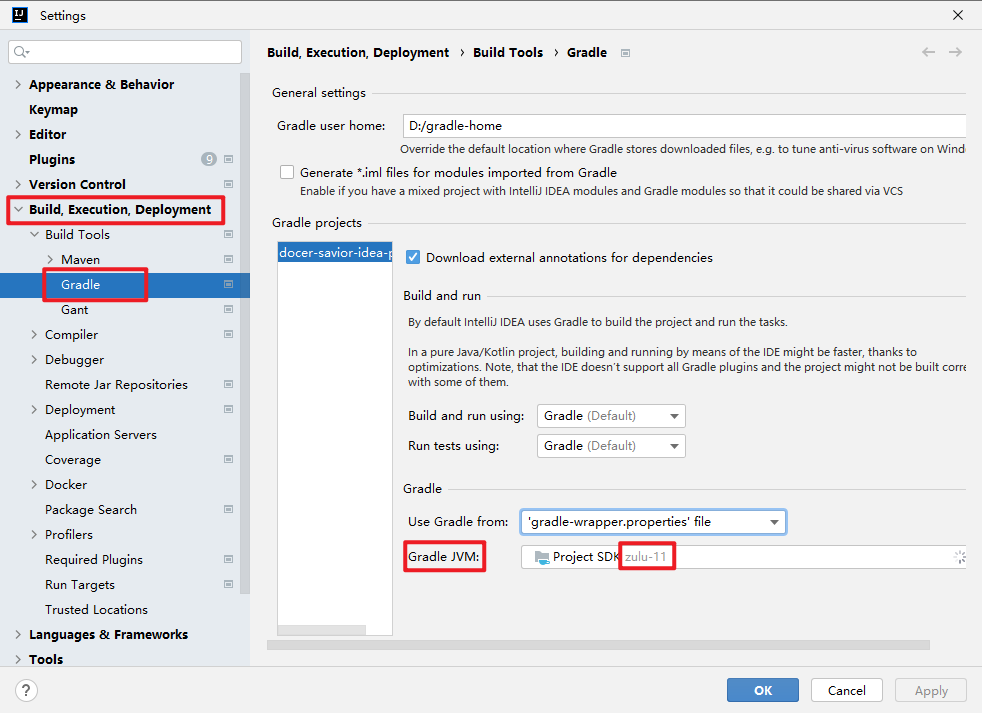
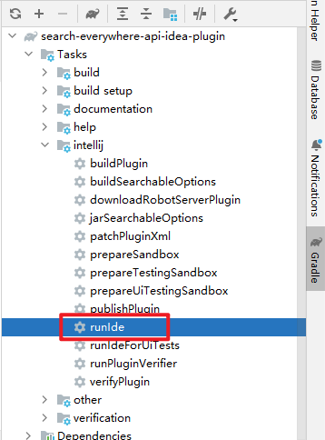

# Contribution Guidelines
> First, thank you for considering contributing to this project. People like you make this plugin such a great tool.

## ask questions
> Currently, we use Github Issues to manage bugs, please submit a `bug report` on the [Issues page](https://github.com/docer-savior/docer-savior-idea-plugin/issues)

## Suggestions
> Currently, we use Github Issues to collect suggestions, please submit `feature request` on the [Issues page](https://github.com/docer-savior/docer-savior-idea-plugin/issues)

Also, feel free to post on the [Github Forum](https://github.com/docer-savior/docer-savior-idea-plugin/discussions) when you need to discuss some features!

## Submit PR

> When you plan to do this, please accept the thanks in advance! Then, I'll tell you exactly what to do!

- First of all, please remember to Fork this repository to your own account to modify the code!

### Determine branch
- In general, use the latest `master` branch.
- When you need to modify a certain version, you can determine the branch through `version/x.x.x`, such as `version/2.0.9` for version 2.0.9; in addition, please submit a PR in this case Merged into the `version/x.x.x` branch.

### Development and debugging
> This project uses a newer plugin development method (that is, using Gradle), you only need to open this project with IDEA!
> Here are some notes:

- Currently IDEA's own Java runtime basically requires Java 11, so you must make sure to have this version of the JDK.
- After opening the project, if you usually develop projects using Java 8, you may need to do some settings, such as:

#### Project SDK Settings

#### Gradle JVM set to 11

> The rest depends on the network. In this process, you may download an IDEA community edition (generally more than 600 M), a JBR (visible at runtime, about), and dependent jars, etc.

### Running and packaging

#### run

#### package

#### Code structure description

There are 3 main packages under cn.gudqs7.plugins, namely `common / diagnostic / xxx`, which function as follows:
- common: some common classes, tools and base classes
- diagnostic: access IDEA exception handling component
- xxx: xxx

> For more code questions or suggestions, please contact me by email or issue!